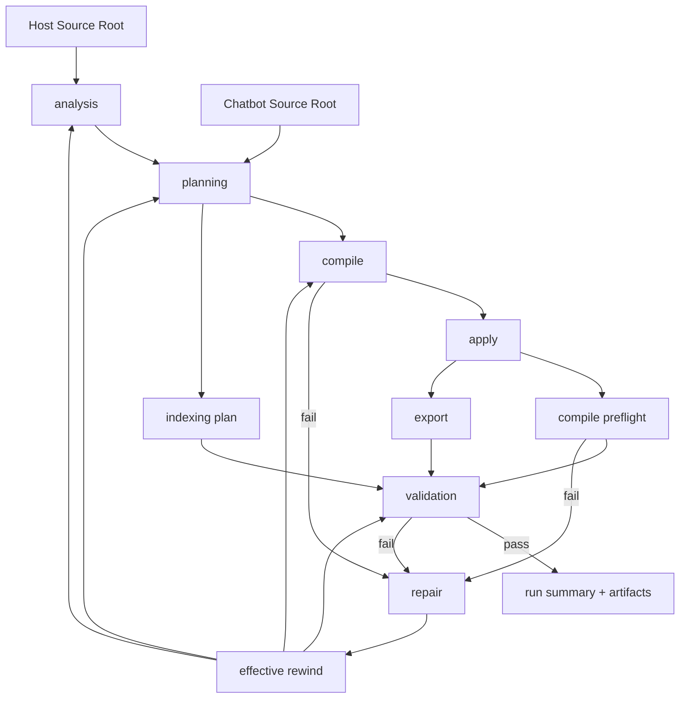

# Onboarding V2 이해 가이드

> 대상: `chatbot/src/onboarding_v2`를 처음 읽는 초보 개발자
>
> 목적: "이 코드가 무엇을 하는지", "왜 이렇게 설계됐는지", "어디부터 읽어야 하는지"를 빠르게 이해하도록 돕는 문서

## 1. 먼저 한 줄로 요약

`onboarding_v2`는 "호스트 쇼핑몰 프로젝트와 챗봇 프로젝트를 자동으로 연결하는 통합 파이프라인"입니다.

더 정확히 말하면:

- 호스트 프로젝트 코드를 분석하고
- 어떤 파일을 어떻게 수정해야 할지 계획한 뒤
- 실제 소스가 아닌 격리된 runtime workspace에 먼저 적용하고
- host/chatbot 각각의 배포용 patch를 만들고
- 실제 인증/주문/대화 흐름까지 검증하고
- 실패하면 필요한 단계까지만 되감아 다시 시도합니다.

즉, 단순한 코드 생성기가 아니라 `분석 -> 설계 -> 수정안 생성 -> 적용 -> 검증 -> 복구`까지 포함한 실행 엔진입니다.

## 2. 왜 V2가 필요했나

이전 관점에서는 "한 번 생성해서 바로 성공"을 기대하기 쉬웠습니다. 그런데 실제 온보딩은 그렇게 단순하지 않습니다.

문제가 되는 지점은 보통 이런 것들입니다.

- 사이트마다 라우터/인증/주문 구조가 조금씩 다름
- LLM이 파일이나 경로를 잘못 해석할 수 있음
- 코드 수정은 맞아 보여도 실제 런타임에서 import 오류가 날 수 있음
- host 프로젝트 수정과 chatbot 프로젝트 수정은 성격이 다름
- 실패했을 때 어디부터 다시 해야 하는지 판단이 필요함

그래서 V2는 "완벽한 1회 생성"보다 "실패를 관측하고, 안전하게 재시도하고, 증거를 남기는 구조"에 더 집중합니다.

## 3. 개발이 어떻게 진행돼 왔는가

`docs/plans/`와 현재 코드를 보면, V2는 아래 순서로 점점 단단해졌다고 볼 수 있습니다.

### 2026-03-22: repair loop 개념 정리

- 실패를 그냥 1회 실패로 끝내지 않고,
- 실패 signature를 만들고,
- run 수준 수정과 generator 수준 수정을 구분하는 생각이 정리됐습니다.

핵심 문서:

- `docs/plans/2026-03-22-onboarding-repair-eval-retry-agent-design.md`

### 2026-03-23: host/chatbot dual-patch 구조 확립

- host 수정과 chatbot 수정을 분리해서 다루기 시작했습니다.
- plan, compile, apply, export, validation이 모두 dual-target 구조로 바뀌었습니다.
- widget order flow 검증도 강화됐습니다.

핵심 문서:

- `docs/plans/2026-03-23-onboarding-v2-dual-patch-adapter-widget.md`

### 2026-03-24: compile preflight 도입

- validation까지 가서 늦게 터지지 않도록
- chatbot workspace에 대해 import graph를 먼저 검사하는 preflight가 추가됐습니다.
- `ecommerce.backend`, `SessionLocal` 같은 금지 import를 조기에 잡습니다.

핵심 문서:

- `docs/plans/2026-03-24-chatbot-runtime-import-preflight.md`

### 2026-03-25: rewind 판단 안정화

- repair LLM이 말한 `rewind_to`를 그대로 믿지 않고
- 실제 override footprint를 보고 `effective_rewind_to`를 엔진이 deterministic하게 계산하도록 안정화했습니다.
- Flask wiring 지원도 강화됐습니다.

핵심 문서:

- `docs/plans/2026-03-25-flask-rewind-stabilization.md`

### 2026-03-26: LLM 비용 관측성 강화

- LLM 호출 토큰 수뿐 아니라 비용 추정도 summary artifact로 남기도록 개선됐습니다.
- 운영 관점의 가시성이 더 좋아졌습니다.

핵심 문서:

- `docs/plans/2026-03-26-onboarding-v2-llm-cost-summary-design.md`
- `docs/plans/2026-03-26-onboarding-v2-llm-cost-summary.md`

## 4. 아키텍처 한눈에 보기



이 그림에서 중요한 포인트는 3가지입니다.

1. `engine.py`가 전체 오케스트레이션을 담당합니다.
2. host와 chatbot은 compile/apply/export 단계에서 분리된 lane으로 다뤄집니다.
3. 실패 시 항상 처음부터 다시 하지 않고, 필요한 stage까지만 rewind 합니다.

## 5. 폴더별 역할

| 위치 | 역할 |
| --- | --- |
| `engine.py` | 전체 파이프라인 오케스트레이터 |
| `analysis/` | 프로젝트 구조를 읽고 사실(facts)을 뽑는 단계 |
| `planning/` | 어떤 전략으로 어떤 파일을 수정할지 결정 |
| `compile/` | plan을 실제 edit program으로 변환 |
| `apply/` | edit program을 runtime workspace에 적용 |
| `export/` | runtime 결과를 host/chatbot patch로 내보내고 replay 검증 |
| `validation/` | 실제 런타임 기동, 인증, 위젯, 주문, 대화 시나리오 검증 |
| `repair/` | 실패 원인 묶기, rewind 결정, 재실행 준비 |
| `storage/` | events/artifacts/views/debug 저장 |
| `models/` | 단계 간 데이터 계약(Pydantic 모델) |
| `llm_runtime.py` | structured LLM 호출, fallback, token/cost 기록 |
| `stage_tools.py` | LLM이 읽을 수 있는 파일 범위를 allowlist로 제한 |

## 6. 단계별 흐름 이해하기

초보 개발자에게는 아래 비유로 이해하면 쉽습니다.

- `analysis`: 현장 조사
- `planning`: 설계서 작성
- `compile`: 작업 지시서 생성
- `apply`: 실험실에 적용
- `export`: 배포 가능한 patch 생성
- `validation`: 실제 시나리오 테스트
- `repair`: 실패 분석 후 부분 재시도

### 6.1 analysis

주요 파일:

- `chatbot/src/onboarding_v2/analysis/analyzer.py`
- `chatbot/src/onboarding_v2/models/analysis.py`

하는 일:

- repo 경계와 framework를 파악합니다.
- 후보 파일(`CandidateSet`)을 수집합니다.
- 읽을 파일 queue를 정합니다.
- evidence 요약을 만들고 verified contract를 뽑습니다.
- 최종적으로 `AnalysisBundle`, `AnalysisSnapshot`을 만듭니다.

중요한 특징:

- 완전 LLM 의존이 아닙니다.
- 후보 파일 수집과 검증은 deterministic 코드가 담당합니다.
- LLM은 retrieval plan, evidence summary, contract extraction을 "보조"합니다.
- `stage_tools.py`를 통해 LLM이 읽을 수 있는 파일이 allowlist로 제한됩니다.

쉽게 말하면:

"이 프로젝트에서 인증은 어디에 있고, 주문 API는 어디에 있고, 위젯은 어디에 꽂을 수 있는가?"를 사실 기반으로 정리하는 단계입니다.

### 6.2 planning

주요 파일:

- `chatbot/src/onboarding_v2/planning/planner.py`
- `chatbot/src/onboarding_v2/models/planning.py`

하는 일:

- 목표 capability가 analysis 결과로 충분히 커버되는지 확인합니다.
- backend/frontend/chatbot 전략을 고릅니다.
- 어떤 파일을 target으로 삼을지 binding 합니다.
- validation 계획과 risk register, repair hints를 만듭니다.
- 최종 `IntegrationPlan`을 생성합니다.

특히 중요:

- `coverage_report`가 gate 역할을 합니다.
- 필요한 계약이 비어 있으면 compile로 가지 못합니다.
- `chatbot_server_base_url`이 비어 있으면 plan 생성이 실패합니다.

즉 planning은 단순한 "수정 대상 선택"이 아니라, "이 분석 결과로 정말 안전하게 진행해도 되는가"를 한 번 더 검문하는 단계입니다.

### 6.3 compile

주요 파일:

- `chatbot/src/onboarding_v2/compile/compiler.py`
- `chatbot/src/onboarding_v2/compile/registry.py`
- `chatbot/src/onboarding_v2/compile/strategies/backend/*.py`
- `chatbot/src/onboarding_v2/compile/strategies/frontend/*.py`
- `chatbot/src/onboarding_v2/compile/strategies/chatbot/generated_adapter.py`

하는 일:

- `IntegrationPlan`을 받아 실제 수정 bundle로 변환합니다.
- backend 전략은 Django/Flask/FastAPI에 따라 다릅니다.
- frontend 전략은 mount/API client 수정으로 나뉩니다.
- chatbot 쪽은 generated adapter package와 setup 등록 코드를 만듭니다.

결과물:

- `host-edit-program`
- `chatbot-edit-program`

중요한 점:

- V2는 host와 chatbot을 한 덩어리로 수정하지 않습니다.
- dual-patch 구조라서 compile 결과도 둘로 나뉩니다.

### 6.4 apply

주요 파일:

- `chatbot/src/onboarding_v2/apply/executor.py`

하는 일:

- 원본 source를 직접 수정하지 않습니다.
- 먼저 source snapshot과 runtime workspace를 복사합니다.
- 그 위에 compiled edit program을 적용합니다.

왜 중요한가:

- 실패하더라도 원본 프로젝트를 더럽히지 않습니다.
- 이후 export 단계에서 patch를 깔끔하게 만들 수 있습니다.

즉 apply는 "실제 프로젝트에 바로 반영"이 아니라 "격리된 실험실에서 먼저 적용"입니다.

### 6.5 compile preflight

주요 파일:

- `chatbot/src/onboarding_v2/compile/preflight.py`

하는 일:

- chatbot runtime source에 금지 import가 있는지 검사합니다.
- `server_fastapi.py`가 실제 import 가능한지도 확인합니다.

왜 중요했나:

- 예전에는 이런 문제가 validation 단계에서 늦게 터졌습니다.
- 지금은 compile 직후 바로 잡아서 더 빠르고 정확하게 rewind 할 수 있습니다.

대표적으로 잡는 문제:

- `ecommerce.backend` import
- `SessionLocal` import
- `server_fastapi.app` import 실패

### 6.6 export

주요 파일:

- `chatbot/src/onboarding_v2/export/replay.py`

하는 일:

- runtime workspace와 baseline을 비교해서 patch를 만듭니다.
- host patch와 chatbot patch를 따로 생성합니다.
- 깨끗한 replay workspace에 patch를 다시 적용해 봅니다.
- 대상 파일이 정확히 일치하는지, 정적 검증이 통과하는지 확인합니다.

왜 중요한가:

- runtime workspace에서 우연히 성공한 결과가 아니라
- 실제 배포 가능한 patch인지 검증하기 위함입니다.

### 6.7 indexing

주요 파일:

- `chatbot/src/onboarding_v2/indexing/coordinator.py`

하는 일:

- FAQ, policy, discovery_image 같은 retrieval corpus를 인덱싱합니다.
- 일부는 host export lane과 병렬로 실행됩니다.
- 성공한 corpus가 있으면 capability profile이 업그레이드됩니다.

중요한 관찰:

- retrieval은 필수 core flow가 아니라 optional capability 확장입니다.
- 실패해도 blocking check가 아니라 advisory check로 남길 수 있습니다.

### 6.8 validation

주요 파일:

- `chatbot/src/onboarding_v2/validation/runner.py`
- `chatbot/src/onboarding_v2/models/validation.py`

validation은 단순 unit test가 아니라, "이 통합이 실제로 쓸 만한가?"를 확인하는 단계입니다.

주요 체크 순서:

1. backend runtime prep
2. backend runtime boot
3. chatbot runtime boot
4. widget bundle fetch
5. host auth bootstrap
6. chatbot adapter auth
7. widget order E2E
8. conversation scenarios
9. replay validation

conversation scenario까지 보는 이유:

- 주문 목록 조회
- 같은 세션에서 후속 질문
- 취소/환불/교환
- 인증 안 된 요청 차단
- 범위 밖 질문 거절

같은 실제 사용자 흐름이 제대로 이어지는지 보려는 것입니다.

### 6.9 repair

주요 파일:

- `chatbot/src/onboarding_v2/repair/synthesis.py`
- `chatbot/src/onboarding_v2/repair/diagnosis.py`
- `chatbot/src/onboarding_v2/engine.py`

하는 일:

- 실패를 `FailureBundle`로 정리합니다.
- 관련 파일 샘플과 artifact version을 묶습니다.
- heuristic 또는 LLM을 사용해 rewind 지점을 결정합니다.
- state를 필요한 단계까지만 비우고 다시 실행합니다.

여기서 핵심은 `effective_rewind_to`입니다.

- LLM이 `"validation"`이라고 말해도
- 실제 override가 planning/analysis footprint를 건드리면
- 엔진이 더 앞 stage로 rewind 합니다.

즉 repair도 LLM 판단을 그대로 믿지 않고, 엔진이 마지막 통제권을 가집니다.

## 7. 이 개발에서 중요했던 설계 포인트

### 7.1 LLM은 보조자이고, 결정권자는 코드다

V2는 LLM을 쓰지만 무한 신뢰하지 않습니다.

- structured JSON만 받음
- parse 실패 시 fallback 사용
- target path sanitize
- tool allowlist 제한
- rewind stage도 엔진이 최종 결정

이 철학이 없으면 자동화는 금방 불안정해집니다.

### 7.2 원본 프로젝트를 바로 수정하지 않는다

모든 수정은 runtime workspace에서 먼저 일어납니다.

- 원본 보호
- 재현 가능성 확보
- export/replay 검증 가능

이건 자동 코드 수정 시스템에서 매우 중요한 안전장치입니다.

### 7.3 host와 chatbot은 분리해서 생각해야 한다

이 프로젝트는 결국 두 코드베이스를 연결합니다.

- host는 로그인/주문/위젯 mount를 담당
- chatbot은 generated adapter와 tool routing을 담당

그래서 patch도 두 개, compile 결과도 두 개, workspace도 두 개입니다.

### 7.4 compile preflight는 "빨리 실패하기" 전략이다

validation까지 가서 런타임 import 오류를 보는 건 늦습니다.

그래서 compile 직후에:

- 금지 import 검사
- `server_fastapi` import smoke

를 넣어 문제를 앞당겨 발견합니다.

### 7.5 validation은 실제 사용자 여정을 기준으로 설계됐다

테스트가 "함수 하나 통과"가 아니라:

- 로그인 가능한가
- 토큰 bootstrap 되는가
- adapter가 auth를 검증하는가
- 위젯이 fetch되는가
- 주문 시나리오가 이어지는가
- 대화 정책이 깨지지 않는가

를 봅니다.

즉 기술 검증과 제품 검증이 섞여 있습니다.

### 7.6 observability가 강하다

run마다 아래가 남습니다.

- `events/events.jsonl`
- `artifacts/...`
- `views/run-summary.json`
- `views/timeline.txt`
- `debug/llm/...`
- `debug/llm-usage-summary.json`

이 덕분에 "왜 실패했는지"를 사후 분석하기 쉽습니다.

### 7.7 retrieval은 core flow 위에 얹는 capability upgrade다

RAG가 성공하면 capability profile이 올라가지만,
핵심 order CS flow와 강하게 결합되지는 않습니다.

이 분리는 운영상 중요합니다.

- retrieval이 조금 흔들려도
- order/auth core flow까지 같이 무너지지 않게 하기 위함입니다.

## 8. 실행 결과는 어디에 저장되나

한 run은 대략 이런 구조를 가집니다.

```text
<generated_root>/<site>/<run_id>/
  run.json
  manifest.json
  events/
    events.jsonl
  views/
    run-summary.json
    latest-stage-status.json
    timeline.txt
  debug/
    llm/
    llm-usage.jsonl
    llm-usage-summary.json
  artifacts/
    01-analysis/
    02-planning/
    03-compile/
    04-apply/
    05-validation/
    06-export/
    06-indexing/
    07-repair/
```

초보 개발자에게는 이렇게 기억하면 됩니다.

- `events/`: 실행 로그
- `artifacts/`: 단계별 산출물
- `views/`: 요약 뷰
- `debug/`: LLM 디버그 정보

## 9. 꼭 알아야 하는 용어

### Snapshot

"분석 결과 중 핵심 사실만 모은 정제본"

### Bundle

"그 단계의 전체 맥락과 부가 정보까지 포함한 묶음"

예:

- `AnalysisBundle`
- `PlanningBundle`
- `ValidationBundle`

### Plan

"무엇을 어디에 어떻게 연결할지 정한 실행 설계"

대표:

- `IntegrationPlan`

### Edit Program

"실제 코드 수정 명령 묶음"

대표:

- `host-edit-program`
- `chatbot-edit-program`

### Patch

"배포 가능한 diff 결과물"

대표:

- `host-approved.patch`
- `chatbot-approved.patch`

### Rewind

"실패 후 어느 stage부터 다시 시작할지 정하는 것"

## 10. 초보 개발자가 읽는 추천 순서

### 1단계: 전체 그림 먼저

아래 파일부터 읽으면 좋습니다.

- `chatbot/src/onboarding_v2/engine.py`
- `chatbot/tests/onboarding_v2/test_food_vertical_slice.py`
- `chatbot/tests/onboarding_v2/test_engine_entry.py`

이 단계의 목표:

"아, 이 시스템은 stage 기반 파이프라인이구나"를 이해하는 것

### 2단계: 분석/계획 이해

- `chatbot/src/onboarding_v2/analysis/analyzer.py`
- `chatbot/src/onboarding_v2/planning/planner.py`
- `chatbot/tests/onboarding_v2/test_analyzer.py`
- `chatbot/tests/onboarding_v2/test_planner.py`

이 단계의 목표:

"어떤 사실을 뽑고, 그걸 어떻게 plan으로 바꾸는가" 이해하기

### 3단계: 수정 생성과 적용 이해

- `chatbot/src/onboarding_v2/compile/compiler.py`
- `chatbot/src/onboarding_v2/compile/preflight.py`
- `chatbot/src/onboarding_v2/apply/executor.py`
- `chatbot/src/onboarding_v2/export/replay.py`
- `chatbot/tests/onboarding_v2/test_compiler.py`
- `chatbot/tests/onboarding_v2/test_apply_executor.py`
- `chatbot/tests/onboarding_v2/test_export_replay.py`

이 단계의 목표:

"왜 runtime workspace를 쓰고, 왜 patch replay를 다시 하는가" 이해하기

### 4단계: 검증과 복구 이해

- `chatbot/src/onboarding_v2/validation/runner.py`
- `chatbot/src/onboarding_v2/repair/diagnosis.py`
- `chatbot/src/onboarding_v2/repair/synthesis.py`
- `chatbot/tests/onboarding_v2/test_validation_runner.py`
- `chatbot/tests/onboarding_v2/test_repair.py`

이 단계의 목표:

"이 시스템이 실패를 어떻게 다루는가" 이해하기

### 5단계: 저장 구조와 운영 관점 이해

- `chatbot/src/onboarding_v2/storage/artifact_store.py`
- `chatbot/src/onboarding_v2/storage/event_store.py`
- `chatbot/src/onboarding_v2/storage/view_projector.py`
- `chatbot/src/onboarding_v2/storage/llm_usage_store.py`
- `chatbot/tests/onboarding_v2/test_storage.py`

이 단계의 목표:

"실행 후 어떤 증거가 남고, 운영자가 무엇을 볼 수 있는가" 이해하기

## 11. 발표하거나 설명할 때 이렇게 말하면 된다

짧게 설명해야 한다면 아래 문장을 써도 됩니다.

> `onboarding_v2`는 쇼핑몰 host 코드와 챗봇 코드를 자동 연결하는 단계형 파이프라인입니다. 먼저 프로젝트를 분석해서 인증/주문/프론트 seam을 찾고, 그 결과로 integration plan을 만든 다음, 실제 소스를 바로 바꾸지 않고 격리된 runtime workspace에 수정안을 적용합니다. 이후 host/chatbot 각각의 patch를 생성하고, 인증/주문/위젯/대화 시나리오까지 검증합니다. 실패하면 repair 단계가 원인을 정리하고 필요한 stage까지만 rewind 해서 다시 돌립니다.

## 12. 마지막 정리

초보 개발자가 이 코드를 볼 때 가장 먼저 기억해야 할 것은 세 가지입니다.

1. 이것은 단일 생성 함수가 아니라 stage 기반 파이프라인이다.
2. LLM을 쓰지만, 중요한 통제는 deterministic 코드가 잡고 있다.
3. 성공보다도 "실패를 추적하고 안전하게 재시도하는 구조"가 이 설계의 핵심이다.
