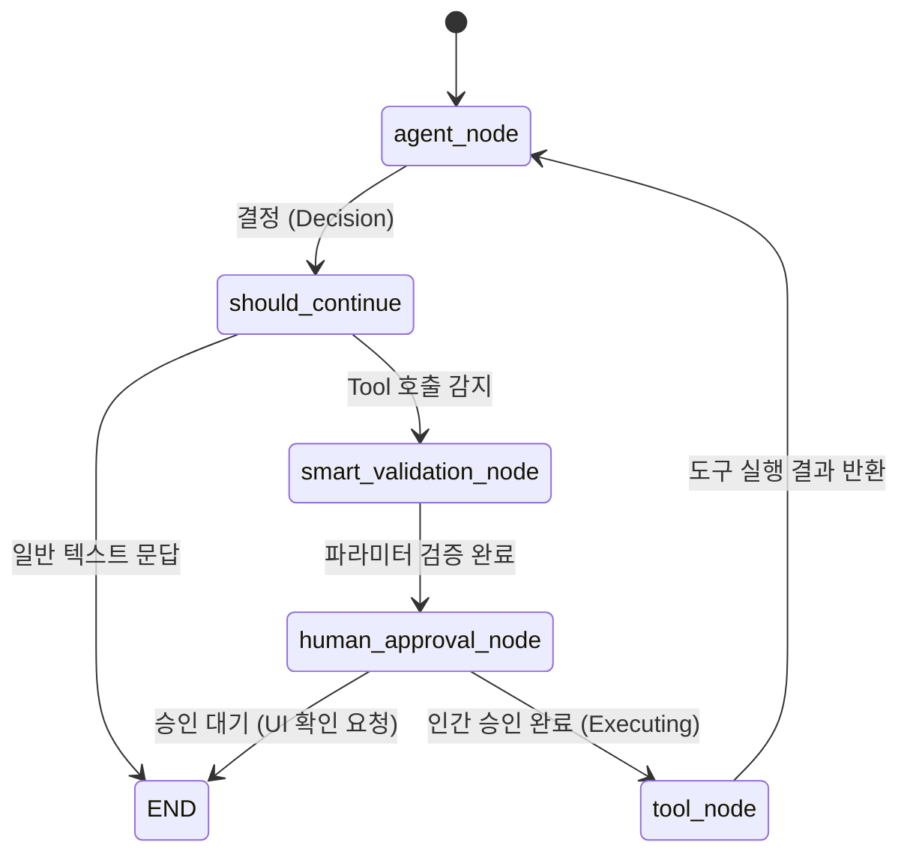

# 8. LLM (AI 파이프라인 및 서빙)

우리 플랫폼의 두뇌를 담당하는 LLM 인프라 설계 철학은 "도메인 데이터가 결합된 정확도(Accuracy)"와 **"상용 서비스를 위한 비용 최적화(Cost-efficiency) 및 안정성 보장"** 입니다.

## 아키텍처 및 데이터 파이프라인 구성

단순히 프롬프트를 쏘는 것을 넘어서, 이커머스 특화의 복합적 의도를 다루는 챗봇을 구현하기 위해 **에이전틱 RAG(Agentic RAG)**와 **LangGraph 워크플로우** 엔진을 사용했습니다.

1. **Context Injection & Retrieval**: 원시화된 무신사 FAQ와 커머스 약관 등을 비식별화, 문맥 단위 분할(Chunking) 후 벡터 저장소(Qdrant)에 임베딩 인덱스화 하였습니다. 자연어 질문이 들어오면 의미와 키워드 가중치를 섞어 가장 확률이 높은 Fact-Data만 꺼내옵니다.
2. **LangGraph 기반의 의도 및 Tool 라우팅 체계**: 고객의 불명확한 단어("어제 산 바지 취소할래")에서도 정확히 의도(주문 취소)와 객체(바지, 어제)를 분리 파악한 후, 사전에 정의되어 있는 17여 개의 파이썬 백엔드 함수(Tool) 중 해당 요청 처리에 완벽하게 맞는 서버 API를 역호출(Function Calling)합니다.

## LangGraph 기반 Node Architecture (안전망 및 분기 처리)

AI가 고객의 돈(결제 금액, 환불 등)이 직결되는 액션을 임의로 실행하지 못하도록, 상태 전이 그래프(State Graph) 상에 프로덕션 레벨의 **안전망(Guardrail)** 노드들을 순차적으로 배치했습니다.

### 핵심 노드(Node)별 실무 구현 역할

1. **`agent_node` (초기 판단 및 컨텍스트 주입)**:
   - 사용자의 자연어 입력과 최근 대화 기록(Context)을 분석하여, 단순 일상 대화인지 백엔드 API(Tool) 호출이 필요한 커머스 액션인지 판단합니다.
   - 사용자 세션 정보(`user_info`), 직전 행동 의도(`prior_action`)를 프롬프트에 동적으로 주입하여 "그거 다 취소해"와 같은 대명사 지시어의 맥락을 연결합니다.

2. **`smart_validation_node` (스마트 검증 및 의도 보정)**:
   - LLM이 도구(예: `register_return_request`)를 호출했을 때, 주문 번호(`order_id`) 등 **필수 파라미터가 누락되었는지 중간에서 가로채어(Intercept) 검사**합니다.
   - 누락이 감지되면 억지로 동작하지 않고, 스스로 궤도를 수정해 "어떤 주문을 취소하시겠어요?" 라며 `get_user_orders` 도구를 호출하는 방향으로 강제 라우팅(Routing)합니다.

3. **`human_approval_node` (인간 최종 승인 단계)**:
   - 결제 취소, 반품 접수 등 `SENSITIVE_TOOLS` 목록에 해당하는 액션은 이 노드를 무조건 거치게 됩니다.
   - 사용자가 "응", "진행해" 라고 명시적으로 동의(LLM 판별 및 키워드 Fallback)하거나 UI 버튼을 누른 상태(`executing`)가 아니면 작업을 보류(Pending)하고 프론트엔드로 승인 요청을 위임합니다. 발생 가능한 금전적/법적 문제를 원천 차단하는 가장 중요한 프로덕션 장치입니다.

4. **`tool_node` (실제 백엔드 도구 실행)**:
   - 모든 검증과 승인을 마친 액션에 대해 최종적으로 파이썬 백엔드 함수(예: `cancel_order`)를 안전하게 실행하고, 그 결과(Return)를 다시 `agent_node`에 전달해 사용자에게 최종 확정 메시지를 생성케 합니다.

## 🚀 비용 최적화 (Cost) 및 모델 스케일업 전략

현재는 개발 및 벤치마킹 검증을 위해 NLU 성능이 가장 뛰어난 **OpenAI API(GPT-4o)**를 활용(Baseline)하고 있습니다. 그러나 상용 서비스 운영 시의 **토큰 비용 부담 및 초당 속도 제약**을 타개하기 위해 철저한 독립 서빙 전략을 병행하고 있습니다.

1. **Synthetic Data를 활용한 Llama 3 (또는 Mistral 등) Fine-Tuning**:
   - OpenAI의 로직으로 챗봇 벤치마크 데이터를 추출(Q/A 쌍 및 Tool 매핑)하여 구축된 1,500개 커스텀 데이터셋을 활용, 소형 파라미터 오픈소스 LLM을 미세조정(Fine-Tuning) 중입니다.
2. **vLLM 및 RunPod 기반의 가성비-고성능 추론 서버 운용**:
   - 파인튜닝된 자체 모델을 AWS가 아닌, 스팟/컨테이너 구동형 클라우드인 **RunPod (A100 / T4 GPU 등)** 환경에 올려 연산 고정비를 크게 줄입니다.
   - 단일 요청 처리가 느린 일반 트랜스포머 엔진 대신 메모리(PagedAttention 기법) 관리가 압도적인 **`vLLM` 서빙 가속 라이브러리**를 스택으로 채용했습니다.
   - 이로써 다중 유저가 동시다발적으로 상품을 질의하더라도(고 트래픽 상태), LLM 메모리 경합 없이 토큰 생성 속도를 수십 % 이상 증대시켜 챗봇 응답 대기 지연(Latency) 문제를 무마시킵니다.
